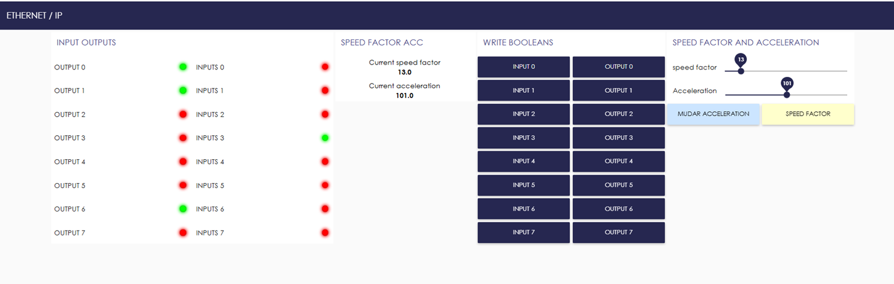

# Communication Protocols and Industrial Applications

## O Projeto

Este repositório contém **exemplos de comunicação industrial utilizando Ethernet/IP**.  
Foram implementados:

1. Um **servidor Ethernet/IP simulado** (`sim_ethernet_ip_server.py`), responsável por expor variáveis (tags) que representam entradas, saídas e parâmetros de processo.
2. Um **serviço Flask (REST API)** (`service_ethernet_ip.py`), que atua como cliente Ethernet/IP. Ele lê/escreve nas tags do servidor através de requisições HTTP.

---

## Autores

- Thiago Rodrigo Monteiro Salgado
- Gledyson Cidade

Universidade Federal do Amazonas - PPGEE

---

## Requisitos

- Python 3.9+
- Biblioteca [cpppo](https://github.com/pjkundert/cpppo)
- Flask

Instale todas as dependências com:

```bash
pip install -r requirements.txt
```

---

## Como Executar

### 1. Iniciar o Servidor Ethernet/IP

Este servidor simula variáveis industriais como `acceleration`, `speed_factor`, `inputs` e `outputs`.

```bash
python sim_ethernet_ip_server.py
```

Isso significa que o servidor Ethernet/IP está rodando localmente (porta padrão `44818`).

---

### 2. Iniciar o Serviço REST (Cliente)

Em outro terminal:

```bash
python service_ethernet_ip.py
```

📌 Saída esperada:

```
 * Running on http://0.0.0.0:5000
```

Agora sua API REST está rodando na porta **5000**.

---

## Rotas Disponíveis

### Leitura de variáveis

- `GET /acceleration`
- `GET /speed_factor`
- `GET /inputs/<index>`
- `GET /outputs/<index>`

### Escrita de variáveis

- `POST /acceleration`  
  Body: `{"value": 10.5}`

- `POST /speed_factor`  
  Body: `{"value": 2.0}`

- `POST /inputs/<index>` → alterna o valor (`True/False`) no bit escolhido
- `POST /outputs/<index>` → alterna o valor (`True/False`) no bit escolhido

---

## Exemplos de Teste (via curl)

Ler aceleração:

```bash
curl http://localhost:5000/acceleration
```

Definir aceleração:

```bash
curl -X POST http://localhost:5000/acceleration -H "Content-Type: application/json" -d '{"value": 12.34}'
```

Alternar saída 0:

```bash
curl -X POST http://localhost:5000/outputs/0
```

---

## requirements.txt

```txt
flask==3.0.3
cpppo==4.0.0
```

## Node-RED - Interface

Além disso, você pode importar o json com o programa do node-red para poder gerar uma interface de fácil comunicação com o cliente.


